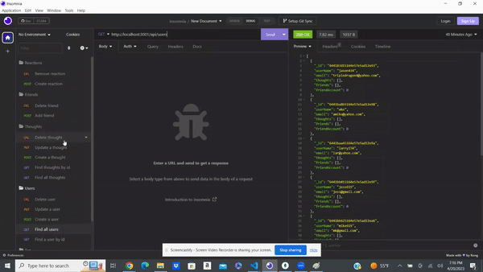
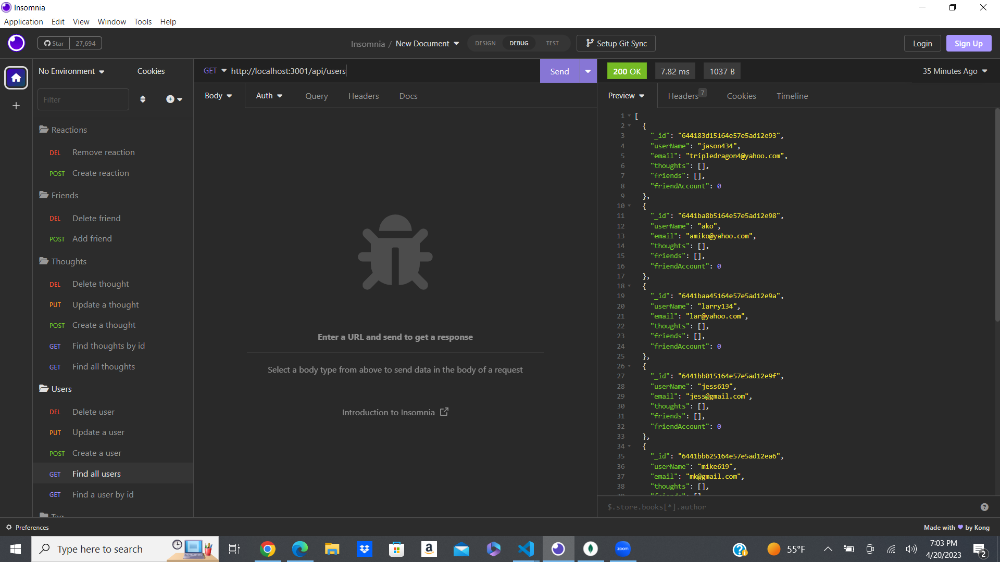

# Network-Api

## Table of Contents
* [Installation](#installation)
* [Usage](#usage)
* [Screenshot](#screenshot)
* [links](#links)

### Description
an API for a social network web application where users can share their thoughts, react to friends’ thoughts, and create a friend list.

### Installation
* Node.js
* Express.js
* MongoDB
* Mongoose
### Gif

### Screenshot
 

### links
# github
https://github.com/siddz415/Network-Api

# video
https://drive.google.com/file/d/1x9u2h6BEaXIzZmLav9l5KzGsv5GLoRzt/view